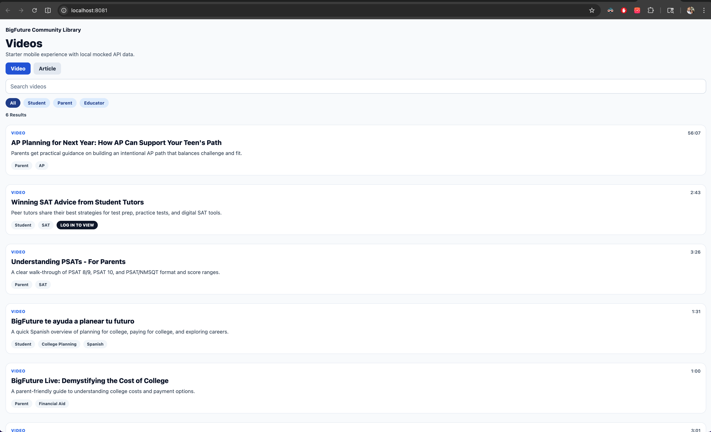
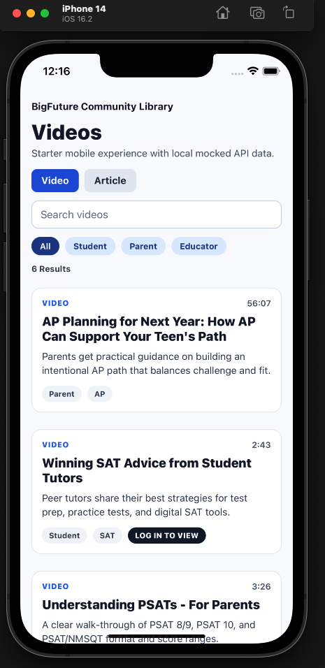

# React Native App

Starter Expo React Native app with live Community Hub API data.

## Videos

- [community library ios app](docs/videos/community-library-ios-app.mp4)
- [community library android app](docs/videos/community-library-android-app.mp4)
- [community library webapp](docs/videos/community-library-webapp.mp4)

## Screenshots

### QR Code


### Web



### iOS



### Android


## Prerequisites (system)

- Node.js 18+
- npm 9+
- Xcode (for iOS simulator on macOS)
- Android Studio (for Android emulator)

Note: A global Expo CLI binary is not required. This project uses npx.

## Verify requirements

Run this script to validate local machine requirements for this Expo project:

```bash
npm run check:requirements
```

This check is tuned for macOS Monterey on a 2015 MacBook Pro and validates:

- Node.js and npm versions
- Xcode, xcodebuild, simctl, and iOS runtimes
- Android SDK directory, adb, emulator, and AVD presence
- Java and optional watchman

## Install

```bash
npm install
```

## One-command workflow

Use these commands if you want setup and run steps in one place:

- Setup only (install/check/fix versions):
	```bash
	npm run quickstart
	```

- Setup + run iOS:
	```bash
	npm run quickstart:ios
	```

- Setup + run Android:
	```bash
	npm run quickstart:android
	```

- Setup + run web:
	```bash
	npm run quickstart:web
	```

The quickstart flow runs this sequence:

1. Install dependencies (if node_modules is missing):
	```bash
	npm install
	```

2. Validate requirements:
	```bash
	npm run check:requirements
	```

3. Fix Expo dependency alignment:
	```bash
	npx expo install --fix
	```

4. starts target platform if provided

## Run (if dependecncies have already been ckecked previously)

- iOS:
	```bash
	npm run ios
	```

- Android:
	```bash
	npm run android
	```

- Web:
	```bash
	npm run web
	```

- Emulator only:
	```bash
	npm run emulator:android
	```

## Web support packages

Web support is handled by project dependencies in package.json:

- react-dom
- react-native-web

If missing, install with:

```bash
npx expo install react-dom react-native-web
```

## Deprecated package warnings

You may see npm warnings for packages like inflight, rimraf@3, and glob@7 during install.

- These are transitive dependencies pulled in by Expo CLI and React Native internals.
- They are not direct app dependencies in this project.
- They are not separate system binaries and should not be listed as OS-level requirements.

Current recommendation:

- Keep Expo SDK dependencies aligned with:
	```bash
	npx expo install --fix
	```

- Update Expo/RN when newer SDK releases replace those transitive packages upstream
- Avoid forcing npm overrides for these packages unless you are ready to test and own breakage risk

## iOS simulator troubleshooting

If iOS launch fails with errors like:

- Unable to boot device because we cannot determine the runtime bundle
- runtime profile not found

it usually means Expo is trying to boot a stale/unavailable simulator UUID.

Use this sequence:

1. Ensure Xcode is selected:
	```bash
	xcode-select -p
	```

Expected path: /Applications/Xcode.app/Contents/Developer

2. Remove stale simulator entries:
	```bash
	xcrun simctl delete unavailable
	```

3. Boot a valid simulator:
	```bash
	open -a Simulator
	xcrun simctl boot "iPhone 14"
	```

4. Start Expo for iOS:
	```bash
	npx expo start --ios
	```

If a simulator hangs on first launch, wait for migration to finish once or reset it in Simulator:

- Device > Erase All Content and Settings

## Android simulator troubleshooting

If Android launch fails (no devices found, emulator not detected, app not opening), use this sequence:

1. Verify Android tools are available:
	```bash
	adb devices
	emulator -list-avds
	```

2. Start an emulator from Android Studio Device Manager, or from terminal:
	```bash
	emulator -avd <YOUR_AVD_NAME>
	```

	or

	```bash
	npm run emulator:android
	```

3. Confirm emulator is connected:
	```bash
	adb devices
	```

4. Start Expo on Android:
	```bash
	npx expo start --android
	```

If detection is flaky:

- Restart adb:
	```bash
	adb kill-server
	adb start-server
	```

- Cold boot or wipe emulator data from Device Manager
- Ensure Android Studio SDK and system images are installed for your AVD
- If content API requests hang/spin on Android while iOS works, relaunch emulator with explicit DNS:
	```bash
	ANDROID_EMULATOR_DNS=8.8.8.8,1.1.1.1 npm run emulator:android
	```
